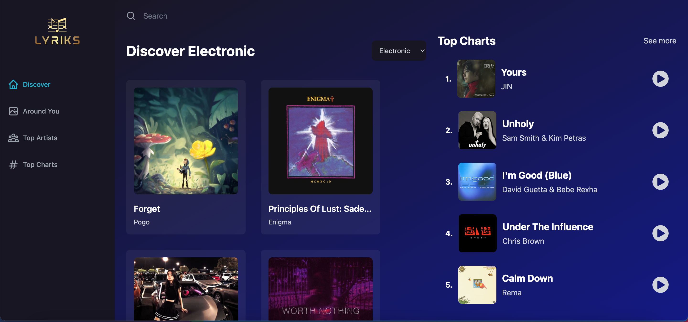

# Musicjam

## short description

Our music app, built using React and Tailwind, offers a unique and personalized listening experience by using the user's geolocation to display popular music from their region. With the ShazamCore API integrated into our app, users can easily search for their favorite songs and artists, discovering new music along the way. The app's sleek and intuitive design make it easy for users to navigate and discover new music. Whether you're looking to find the latest hits or delve into lesser-known tracks, our app has something for everyone.

<a href="https://esuszh-3000.preview.csb.app/">Check website<a/>
